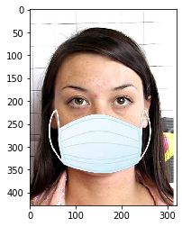
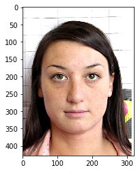
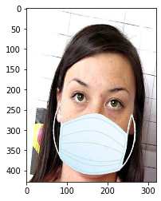
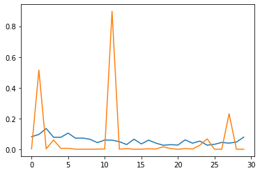
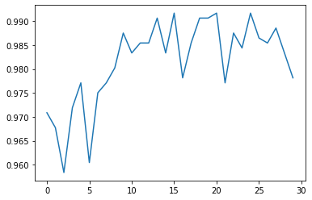

```python
import matplotlib.pyplot as plt
import cv2
# Technically not necessary in newest versions of jupyter
%matplotlib inline
```


```python
with1=cv2.imread('data/train/with_mask/242-with-mask.jpg')
with1 = cv2.cvtColor(with1,cv2.COLOR_BGR2RGB)
```


```python
with1.shape
```


    (428, 320, 3)


```python
plt.imshow(with1)
```


    <matplotlib.image.AxesImage at 0x21f0563aec8>





```python
without1=cv2.imread('data/train/without_mask/242.jpg')
without1 = cv2.cvtColor(without1,cv2.COLOR_BGR2RGB)
```


```python
without1.shape
```


    (428, 320, 3)


```python
plt.imshow(without1)
```


    <matplotlib.image.AxesImage at 0x21f08ea8348>





```python
from keras.preprocessing.image import ImageDataGenerator
```

    Using TensorFlow backend.
    


```python
image_gen = ImageDataGenerator(rotation_range=30, # rotate the image 30 degrees
                               width_shift_range=0.1, # Shift the pic width by a max of 10%
                               height_shift_range=0.1, # Shift the pic height by a max of 10%
                               rescale=1/255, # Rescale the image by normalzing it.
                               shear_range=0.2, # Shear means cutting away part of the image (max 20%)
                               zoom_range=0.2, # Zoom in by 20% max
                               horizontal_flip=True, # Allo horizontal flipping
                               fill_mode='nearest' # Fill in missing pixels with the nearest filled value
                              )
```


```python
plt.imshow(image_gen.random_transform(with1))
```


    <matplotlib.image.AxesImage at 0x21f11211348>





```python
image_gen.flow_from_directory('data/train')
```

    Found 961 images belonging to 2 classes.
    


    <keras.preprocessing.image.DirectoryIterator at 0x21f1126a708>


```python
image_gen.flow_from_directory('data/test')
```

    Found 415 images belonging to 2 classes.
    


    <keras.preprocessing.image.DirectoryIterator at 0x21f11263308>


```python
image_shape = (150,150,3)
```


```python
from keras.models import Sequential
from keras.layers import Activation, Dropout, Flatten, Dense, Conv2D, MaxPooling2D
```


```python
model = Sequential()

model.add(Conv2D(filters=32, kernel_size=(3,3),input_shape=(150,150,3), activation='relu',))
model.add(MaxPooling2D(pool_size=(2, 2)))

model.add(Conv2D(filters=64, kernel_size=(3,3),input_shape=(150,150,3), activation='relu',))
model.add(MaxPooling2D(pool_size=(2, 2)))

model.add(Conv2D(filters=64, kernel_size=(3,3),input_shape=(150,150,3), activation='relu',))
model.add(MaxPooling2D(pool_size=(2, 2)))


model.add(Flatten())


model.add(Dense(128))
model.add(Activation('relu'))

# Dropouts help reduce overfitting by randomly turning neurons off during training.
# Here we say randomly turn off 50% of neurons.
model.add(Dropout(0.5))

# Last layer, remember its binary, 0=cat , 1=dog
model.add(Dense(1))
model.add(Activation('sigmoid'))

model.compile(loss='binary_crossentropy',
              optimizer='adam',
              metrics=['accuracy'])
```


```python
model.summary()
```

    Model: "sequential_1"
    _________________________________________________________________
    Layer (type)                 Output Shape              Param #   
    =================================================================
    conv2d_1 (Conv2D)            (None, 148, 148, 32)      896       
    _________________________________________________________________
    max_pooling2d_1 (MaxPooling2 (None, 74, 74, 32)        0         
    _________________________________________________________________
    conv2d_2 (Conv2D)            (None, 72, 72, 64)        18496     
    _________________________________________________________________
    max_pooling2d_2 (MaxPooling2 (None, 36, 36, 64)        0         
    _________________________________________________________________
    conv2d_3 (Conv2D)            (None, 34, 34, 64)        36928     
    _________________________________________________________________
    max_pooling2d_3 (MaxPooling2 (None, 17, 17, 64)        0         
    _________________________________________________________________
    flatten_1 (Flatten)          (None, 18496)             0         
    _________________________________________________________________
    dense_1 (Dense)              (None, 128)               2367616   
    _________________________________________________________________
    activation_1 (Activation)    (None, 128)               0         
    _________________________________________________________________
    dropout_1 (Dropout)          (None, 128)               0         
    _________________________________________________________________
    dense_2 (Dense)              (None, 1)                 129       
    _________________________________________________________________
    activation_2 (Activation)    (None, 1)                 0         
    =================================================================
    Total params: 2,424,065
    Trainable params: 2,424,065
    Non-trainable params: 0
    _________________________________________________________________
    


```python
batch_size = 10

train_image_gen = image_gen.flow_from_directory('data/train',
                                               target_size=image_shape[:2],
                                               batch_size=batch_size,
                                               class_mode='binary')
```

    Found 961 images belonging to 2 classes.
    


```python
test_image_gen = image_gen.flow_from_directory('data/test',
                                               target_size=image_shape[:2],
                                               batch_size=batch_size,
                                               class_mode='binary')
```

    Found 415 images belonging to 2 classes.
    


```python
train_image_gen.class_indices
```


    {'with_mask': 0, 'without_mask': 1}


```python
test_image_gen.class_indices
```


    {'with_mask': 0, 'without_mask': 1}


```python
len(train_image_gen.labels)
```


    961


```python
import warnings
warnings.filterwarnings('ignore')
```


```python
results = model.fit_generator(train_image_gen,epochs=30,
                              validation_data=test_image_gen)
```

    Epoch 1/30
    97/97 [==============================] - 43s 448ms/step - loss: 0.0807 - accuracy: 0.9709 - val_loss: 0.0022 - val_accuracy: 0.9687
    Epoch 2/30
    97/97 [==============================] - 49s 503ms/step - loss: 0.0955 - accuracy: 0.9677 - val_loss: 0.5151 - val_accuracy: 0.9205
    Epoch 3/30
    97/97 [==============================] - 40s 414ms/step - loss: 0.1337 - accuracy: 0.9584 - val_loss: 0.0024 - val_accuracy: 0.9783
    Epoch 4/30
    97/97 [==============================] - 39s 402ms/step - loss: 0.0774 - accuracy: 0.9719 - val_loss: 0.0604 - val_accuracy: 0.9373
    Epoch 5/30
    97/97 [==============================] - 41s 424ms/step - loss: 0.0771 - accuracy: 0.9771 - val_loss: 0.0058 - val_accuracy: 0.9831
    Epoch 6/30
    97/97 [==============================] - 40s 408ms/step - loss: 0.1137 - accuracy: 0.9605 - val_loss: 0.0059 - val_accuracy: 0.9687
    Epoch 7/30
    97/97 [==============================] - 40s 410ms/step - loss: 0.0713 - accuracy: 0.9750 - val_loss: 1.2659e-04 - val_accuracy: 0.9807
    Epoch 8/30
    97/97 [==============================] - 40s 411ms/step - loss: 0.0719 - accuracy: 0.9771 - val_loss: 4.1835e-04 - val_accuracy: 0.9687
    Epoch 9/30
    97/97 [==============================] - 40s 416ms/step - loss: 0.0641 - accuracy: 0.9802 - val_loss: 6.6237e-05 - val_accuracy: 0.9904
    Epoch 10/30
    97/97 [==============================] - 40s 408ms/step - loss: 0.0424 - accuracy: 0.9875 - val_loss: 8.4013e-04 - val_accuracy: 0.9783
    Epoch 11/30
    97/97 [==============================] - 40s 407ms/step - loss: 0.0594 - accuracy: 0.9834 - val_loss: 0.0017 - val_accuracy: 0.9928
    Epoch 12/30
    97/97 [==============================] - 39s 405ms/step - loss: 0.0584 - accuracy: 0.9854 - val_loss: 0.8971 - val_accuracy: 0.9711
    Epoch 13/30
    97/97 [==============================] - 39s 406ms/step - loss: 0.0488 - accuracy: 0.9854 - val_loss: 5.0974e-05 - val_accuracy: 0.9880
    Epoch 14/30
    97/97 [==============================] - 40s 408ms/step - loss: 0.0301 - accuracy: 0.9906 - val_loss: 0.0044 - val_accuracy: 0.9952
    Epoch 15/30
    97/97 [==============================] - 40s 414ms/step - loss: 0.0647 - accuracy: 0.9834 - val_loss: 2.1790e-05 - val_accuracy: 0.9880
    Epoch 16/30
    97/97 [==============================] - 40s 408ms/step - loss: 0.0343 - accuracy: 0.9917 - val_loss: 4.3367e-04 - val_accuracy: 0.9855
    Epoch 17/30
    97/97 [==============================] - 39s 405ms/step - loss: 0.0583 - accuracy: 0.9781 - val_loss: 0.0029 - val_accuracy: 0.9904
    Epoch 18/30
    97/97 [==============================] - 39s 402ms/step - loss: 0.0393 - accuracy: 0.9854 - val_loss: 0.0016 - val_accuracy: 0.9880
    Epoch 19/30
    97/97 [==============================] - 39s 403ms/step - loss: 0.0257 - accuracy: 0.9906 - val_loss: 0.0159 - val_accuracy: 0.9952
    Epoch 20/30
    97/97 [==============================] - 42s 429ms/step - loss: 0.0294 - accuracy: 0.9906 - val_loss: 0.0042 - val_accuracy: 0.9735
    Epoch 21/30
    97/97 [==============================] - 40s 412ms/step - loss: 0.0268 - accuracy: 0.9917 - val_loss: 2.5404e-04 - val_accuracy: 0.9976
    Epoch 22/30
    97/97 [==============================] - 40s 411ms/step - loss: 0.0609 - accuracy: 0.9771 - val_loss: 0.0039 - val_accuracy: 0.9687
    Epoch 23/30
    97/97 [==============================] - 39s 398ms/step - loss: 0.0389 - accuracy: 0.9875 - val_loss: 0.0018 - val_accuracy: 0.9928
    Epoch 24/30
    97/97 [==============================] - 39s 403ms/step - loss: 0.0524 - accuracy: 0.9844 - val_loss: 0.0258 - val_accuracy: 0.9783
    Epoch 25/30
    97/97 [==============================] - 39s 403ms/step - loss: 0.0262 - accuracy: 0.9917 - val_loss: 0.0676 - val_accuracy: 0.9928
    Epoch 26/30
    97/97 [==============================] - 39s 398ms/step - loss: 0.0318 - accuracy: 0.9865 - val_loss: 3.8065e-05 - val_accuracy: 0.9976
    Epoch 27/30
    97/97 [==============================] - 39s 400ms/step - loss: 0.0438 - accuracy: 0.9854 - val_loss: 4.4600e-05 - val_accuracy: 0.9855
    Epoch 28/30
    97/97 [==============================] - 39s 403ms/step - loss: 0.0392 - accuracy: 0.9886 - val_loss: 0.2309 - val_accuracy: 0.9880
    Epoch 29/30
    97/97 [==============================] - 39s 406ms/step - loss: 0.0460 - accuracy: 0.9834 - val_loss: 1.1775e-05 - val_accuracy: 0.9855
    Epoch 30/30
    97/97 [==============================] - 39s 404ms/step - loss: 0.0779 - accuracy: 0.9781 - val_loss: 1.4996e-04 - val_accuracy: 0.9783
    


```python
results.history
```


    {'val_loss': [0.0021611221600323915,
      0.5150782465934753,
      0.0024136342108249664,
      0.06035153195261955,
      0.00576086575165391,
      0.0058780391700565815,
      0.00012658507330343127,
      0.0004183502751402557,
      6.62367237964645e-05,
      0.0008401254890486598,
      0.0017233766848221421,
      0.8970890045166016,
      5.097367102280259e-05,
      0.0043778689578175545,
      2.1789690435980447e-05,
      0.0004336731508374214,
      0.0029358554165810347,
      0.001633870997466147,
      0.015853984281420708,
      0.004161779303103685,
      0.0002540401474107057,
      0.0038571699988096952,
      0.0017787324031814933,
      0.025797799229621887,
      0.06755150854587555,
      3.8065409171395004e-05,
      4.459976116777398e-05,
      0.23090407252311707,
      1.1775014172599185e-05,
      0.00014995806850492954],
     'val_accuracy': [0.9686747193336487,
      0.9204819202423096,
      0.9783132672309875,
      0.9373493790626526,
      0.983132541179657,
      0.9686747193336487,
      0.9807229042053223,
      0.9686747193336487,
      0.9903614521026611,
      0.9783132672309875,
      0.9927710890769958,
      0.9710843563079834,
      0.9879518151283264,
      0.9951807260513306,
      0.9879518151283264,
      0.9855421781539917,
      0.9903614521026611,
      0.9879518151283264,
      0.9951807260513306,
      0.9734939932823181,
      0.9975903630256653,
      0.9686747193336487,
      0.9927710890769958,
      0.9783132672309875,
      0.9927710890769958,
      0.9975903630256653,
      0.9855421781539917,
      0.9879518151283264,
      0.9855421781539917,
      0.9783132672309875],
     'loss': [0.08140935071583635,
      0.09620777336834774,
      0.1349147398060049,
      0.0780797781772283,
      0.07785520726587668,
      0.10471914878185803,
      0.07195630200946806,
      0.0725313828006771,
      0.06455380669671414,
      0.04284006880016922,
      0.05993084099232738,
      0.05891849902378965,
      0.0492464680689194,
      0.030366099573044467,
      0.06534446079538225,
      0.03466663334413461,
      0.05886721615730744,
      0.03970945148269244,
      0.025904776599334024,
      0.029666528511796297,
      0.02707526041342756,
      0.060985154195305376,
      0.039238352466191416,
      0.052922329717136556,
      0.02638989158102794,
      0.032114263037874444,
      0.04416532670784169,
      0.039589476454674394,
      0.04642281011289321,
      0.078662693986845],
     'accuracy': [0.9708637,
      0.9677419,
      0.9583767,
      0.9719043,
      0.97710717,
      0.96045786,
      0.975026,
      0.97710717,
      0.9802289,
      0.987513,
      0.9833507,
      0.98543185,
      0.98543185,
      0.99063474,
      0.9833507,
      0.9916753,
      0.97814775,
      0.98543185,
      0.99063474,
      0.99063474,
      0.9916753,
      0.97710717,
      0.987513,
      0.9843913,
      0.9916753,
      0.9864724,
      0.98543185,
      0.9885536,
      0.9833507,
      0.97814775]}


```python
plt.plot(results.history['loss'])
plt.plot(results.history['val_loss'])

```


    [<matplotlib.lines.Line2D at 0x21f12cf1408>]





```python
plt.plot(results.history['accuracy'])
```


    [<matplotlib.lines.Line2D at 0x21f136ecac8>]





```python
from keras.preprocessing import image

dog_file = '221.jpg'

dog_img = image.load_img(dog_file, target_size=(150, 150))

dog_img = image.img_to_array(dog_img)

dog_img = np.expand_dims(dog_img, axis=0)
dog_img = dog_img/255
```


```python
model.predict_classes(dog_img)
```


    array([[1]])


```python
model.save('face_mask_detector.h5')
```


```python
face_cascade = cv2.CascadeClassifier('C:/Users/Shivam Shandilya/Desktop/OPEN_CV COURSE/original (2)/Computer-Vision-with-Python/DATA/haarcascades/haarcascade_frontalface_default.xml')
```


```python

    
```


```python
import numpy as np
```


```python
labels_dict={0:'with_mask',1:'without_mask'}
color_dict={1:(0,0,255),0:(0,255,0)}

cap = cv2.VideoCapture(0) 

while True: 
    
    ret, frame = cap.read(0) 
    frame=cv2.flip(frame,1,1)
    face_rects = face_cascade.detectMultiScale(frame.copy(),scaleFactor=1.2, minNeighbors=5) 
    
    for (x,y,w,h) in face_rects: 
        face_img = frame[y:y+h, x:x+w]
        resized=cv2.resize(face_img,(150,150))
        normalized=resized/255.0
        reshaped=np.reshape(normalized,(1,150,150,3))
        
        
        result=model.predict_classes(reshaped)
        
        
        label=result[0][0]
      
        cv2.rectangle(frame,(x,y),(x+w,y+h),color_dict[label],2)
        cv2.rectangle(frame,(x,y-40),(x+w,y),color_dict[label],-1)
        cv2.putText(frame,labels_dict[label], (x, y-10),cv2.FONT_HERSHEY_SIMPLEX,0.8,(255,255,255),2)
    
 
    cv2.imshow('Video Face Detection', frame) 
 
    c = cv2.waitKey(1) 
    if c == 27: 
        break 
        
cap.release() 
cv2.destroyAllWindows()
```


```python

```
## Click the below link to view video
<a href="https://drive.google.com/file/d/1LfbkTjiqyOAzWyjymZ04PaQOZL9_d7oo/view?usp=sharing">Here</a>